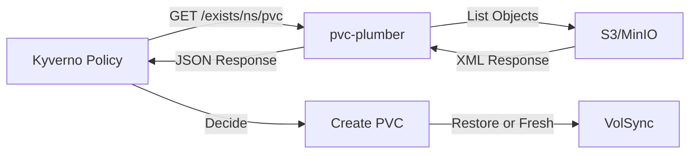

# pvc-plumber

[](https://github.com/mitchross/pvc-pulmber/actions/workflows/build.yaml)
[](https://github.com/mitchross/pvc-pulmber/actions/workflows/release.yaml)

Lightweight K8s service that checks if PVC backups exist in S3. Enables zero-touch disaster recovery with Kyverno + VolSync.

## Overview

**pvc-plumber** is a microservice designed to run in Kubernetes clusters to determine if a Persistent Volume Claim (PVC) should restore from a Restic backup or start fresh. It's intended to be called by Kyverno policies during PVC creation.

### How It Works



When a PVC is created:
1. Kyverno intercepts the creation
2. Calls pvc-plumber to check if backup exists
3. pvc-plumber queries S3 for objects at `{namespace}/{pvc-name}/`
4. Returns JSON indicating if backup exists
5. Kyverno decides whether to restore from backup or create empty PVC

### Key Features

- **Fail-open behavior**: Errors return `exists: false` to prevent PVC creation from hanging
- **Lightweight**: Distroless image under 10MB
- **No external dependencies**: Uses only Go standard library
- **Graceful shutdown**: Handles SIGTERM/SIGINT properly
- **Structured logging**: JSON logs with configurable levels
- **Health checks**: `/healthz` and `/readyz` endpoints for Kubernetes probes

## Quick Start

### Using Docker

```bash
docker run -p 8080:8080 \
  -e S3_ENDPOINT=http://192.168.10.133:30292 \
  -e S3_BUCKET=volsync-backup \
  ghcr.io/mitchross/pvc-pulmber:latest
```

### Using Kubernetes

```yaml
apiVersion: apps/v1
kind: Deployment
metadata:
  name: pvc-plumber
  namespace: kube-system
spec:
  replicas: 2
  selector:
    matchLabels:
      app: pvc-plumber
  template:
    metadata:
      labels:
        app: pvc-plumber
    spec:
      containers:
      - name: pvc-plumber
        image: ghcr.io/mitchross/pvc-pulmber:latest
        ports:
        - containerPort: 8080
          name: http
        env:
        - name: S3_ENDPOINT
          value: "http://minio.minio.svc.cluster.local:9000"
        - name: S3_BUCKET
          value: "volsync-backup"
        - name: HTTP_TIMEOUT
          value: "5s"
        - name: LOG_LEVEL
          value: "info"
        livenessProbe:
          httpGet:
            path: /healthz
            port: http
          initialDelaySeconds: 5
          periodSeconds: 10
        readinessProbe:
          httpGet:
            path: /readyz
            port: http
          initialDelaySeconds: 5
          periodSeconds: 5
        resources:
          requests:
            cpu: 10m
            memory: 16Mi
          limits:
            cpu: 100m
            memory: 32Mi
        securityContext:
          allowPrivilegeEscalation: false
          readOnlyRootFilesystem: true
          runAsNonRoot: true
          runAsUser: 65532
          capabilities:
            drop:
            - ALL
---
apiVersion: v1
kind: Service
metadata:
  name: pvc-plumber
  namespace: kube-system
spec:
  selector:
    app: pvc-plumber
  ports:
  - port: 8080
    targetPort: http
    name: http
```

## API Documentation

### GET /exists/{namespace}/{pvc-name}

Check if a backup exists for the given namespace and PVC.

**Request:**
```bash
curl http://localhost:8080/exists/karakeep/data-pvc
```

**Response (backup exists):**
```json
{
  "exists": true,
  "keyCount": 1
}
```

**Response (no backup):**
```json
{
  "exists": false,
  "keyCount": 0
}
```

**Response (error - fail-open):**
```json
{
  "exists": false,
  "keyCount": 0,
  "error": "timeout waiting for S3 response"
}
```

### GET /healthz

Liveness probe endpoint.

**Response:**
```json
{
  "status": "ok"
}
```

### GET /readyz

Readiness probe endpoint (same as healthz).

**Response:**
```json
{
  "status": "ok"
}
```

## Configuration

All configuration is done via environment variables:

| Variable | Required | Default | Description |
|----------|----------|---------|-------------|
| `S3_ENDPOINT` | Yes | - | S3 endpoint URL (e.g., `http://192.168.10.133:30292`) |
| `S3_BUCKET` | Yes | - | S3 bucket name (e.g., `volsync-backup`) |
| `HTTP_TIMEOUT` | No | `3s` | Timeout for S3 requests (e.g., `5s`, `500ms`) |
| `PORT` | No | `8080` | HTTP server port |
| `LOG_LEVEL` | No | `info` | Log level: `debug`, `info`, `warn`, `error` |

## Local Development

### Prerequisites

- Go 1.22 or later
- Docker (optional, for building images)
- Make (optional, for using Makefile targets)

### Build and Run

```bash
# Install dependencies
go mod download

# Run tests
make test

# Build binary
make build

# Run locally (requires S3_ENDPOINT and S3_BUCKET)
S3_ENDPOINT=http://localhost:9000 S3_BUCKET=test-bucket make run

# Or run directly
S3_ENDPOINT=http://localhost:9000 S3_BUCKET=test-bucket ./pvc-plumber
```

### Run Tests with Coverage

```bash
# Run tests with coverage report
make test

# Generate HTML coverage report
make test-coverage
open coverage.html
```

### Build Docker Image

```bash
# Build production image
make docker-build

# Build debug image (with shell)
make docker-build-debug

# Run with Docker
docker run -p 8080:8080 \
  -e S3_ENDPOINT=http://host.docker.internal:9000 \
  -e S3_BUCKET=test-bucket \
  ghcr.io/mitchross/pvc-pulmber:latest
```

### Testing with MinIO

```bash
# Start MinIO locally
docker run -p 9000:9000 -p 9001:9001 \
  -e MINIO_ROOT_USER=minioadmin \
  -e MINIO_ROOT_PASSWORD=minioadmin \
  minio/minio server /data --console-address ":9001"

# Create test bucket and upload test files
# Then run pvc-plumber pointing to MinIO
S3_ENDPOINT=http://localhost:9000 \
S3_BUCKET=volsync-backup \
./pvc-plumber
```

## Kyverno Integration Example

Here's an example Kyverno policy that uses pvc-plumber:

```yaml
apiVersion: kyverno.io/v1
kind: ClusterPolicy
metadata:
  name: restore-pvc-from-backup
spec:
  background: false
  rules:
  - name: check-and-restore-backup
    match:
      any:
      - resources:
          kinds:
          - PersistentVolumeClaim
    context:
    - name: backupExists
      apiCall:
        urlPath: "http://pvc-plumber.kube-system.svc.cluster.local:8080/exists/{{request.namespace}}/{{request.object.metadata.name}}"
        jmesPath: "exists"
    mutate:
      patchStrategicMerge:
        metadata:
          annotations:
            +(volsync.backube/restore-from-backup): "{{backupExists}}"
```

## Architecture

The service is composed of three main components:

1. **Config Module** (`internal/config`): Loads and validates environment variables
2. **S3 Client** (`internal/s3`): Queries S3 ListObjectsV2 API and parses XML responses
3. **HTTP Handlers** (`internal/handler`): Exposes REST API endpoints

### S3 Communication

pvc-plumber uses the S3 ListObjectsV2 API:

```
GET {S3_ENDPOINT}/{S3_BUCKET}?list-type=2&prefix={namespace}/{pvc}/&max-keys=1
```

It parses the XML response to extract `<KeyCount>`:

```xml
<?xml version="1.0" encoding="UTF-8"?>
<ListBucketResult xmlns="http://s3.amazonaws.com/doc/2006-03-01/">
  <Name>volsync-backup</Name>
  <Prefix>karakeep/data-pvc/</Prefix>
  <KeyCount>1</KeyCount>
  <MaxKeys>1</MaxKeys>
  <IsTruncated>false</IsTruncated>
</ListBucketResult>
```

## Security

- Runs as non-root user (UID 65532 in distroless image)
- Read-only root filesystem compatible
- No privilege escalation
- Minimal attack surface (distroless base image)
- No external dependencies beyond Go standard library

## Performance

- Lightweight: Docker image under 10MB
- Fast startup: < 1 second
- Low resource usage: ~10MB RAM, minimal CPU
- Concurrent request handling via Go's `net/http`

## Troubleshooting

### Check logs

```bash
# If running in Kubernetes
kubectl logs -n kube-system deployment/pvc-plumber

# If running locally, logs go to stdout
```

### Test endpoint manually

```bash
# Health check
curl http://localhost:8080/healthz

# Check if backup exists
curl http://localhost:8080/exists/my-namespace/my-pvc
```

### Enable debug logging

```bash
# Set LOG_LEVEL=debug
LOG_LEVEL=debug ./pvc-plumber
```

### Common issues

**"S3_ENDPOINT is required"**
- Make sure to set the `S3_ENDPOINT` environment variable

**"timeout waiting for S3 response"**
- Increase `HTTP_TIMEOUT` (default 3s)
- Check network connectivity to S3 endpoint
- Verify S3 endpoint URL is correct

**"exists: false" when backup should exist**
- Verify the backup path matches `{namespace}/{pvc-name}/`
- Check S3 bucket name is correct
- Enable debug logging to see the exact S3 query

## Contributing

Contributions are welcome! Please feel free to submit a Pull Request.

## License

This project is open source and available under the MIT License.

## Support

For issues and questions, please open an issue on GitHub: https://github.com/mitchross/pvc-pulmber/issues
